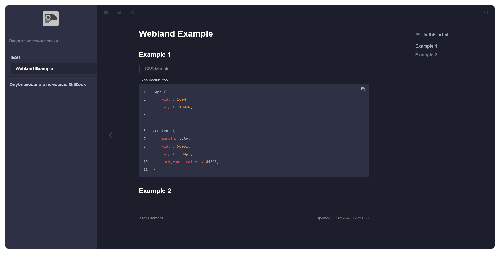

# WEBLAND TUTORIAL

	

> Online synopsis of useful information related to IT technologies. \
>  &#128215; Help is appreciated.

### Links

> * [`Sourse Code`][sourse-code]
> * [`Live Book`][live-book]

### Content &#128640;

* [`Themes`](#Themes)
* [`Language support`](#language-support)
* [`Author`](#author)

	<h6 align="center">Img. Sample article.</з>
	

	

[sourse-code]: https://github.com/luamoris/tutorial
[live-book]: https://luamoris.github.io/tutorial/

---

### Themes

> * __`-`__

### Language support
> * __`-`__

### Creators

	

